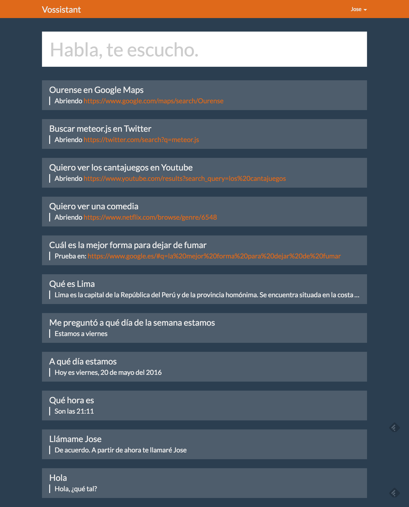

# vossistant

Natural Language Understanding application built in MeteorJS, using [Web Speech API / webkitSpeechRecognition](https://developer.mozilla.org/en-US/docs/Web/API/Web_Speech_API) for voice recognition and [SpeechSynthesisUtterance](https://developer.mozilla.org/en-US/docs/Web/API/SpeechSynthesisUtterance) for Natural Language replies.

[Try it on modulus](https://vossistant-63519.onmodulus.net/) (database gets cleaned periodically).



Based on Intentions-Entities principle, using regular expressions.

Currently in spanish.

Any help is welcome.

(Originally made in a 24h hack rush)

## Flow

1. The server builds a huuuge list of regex-ready commands based on [intentions](https://github.com/joseconstela/vossistant/blob/master/server/ai.js#L1) and [entities](https://github.com/joseconstela/vossistant/blob/master/server/ai.js#54), called ```intelligence```.
2. User gives a command (it creates a mongo doc)
3. If the user input matches an intelligence phrase, it calls [actions](https://github.com/joseconstela/vossistant/blob/master/server/actions.js) (if any) to create actions. See below.
4. If the ```action``` returns ```text```, then ```text``` is saved within the user's original message mongo doc. (see the [chat collection schema](https://github.com/joseconstela/vossistant/blob/master/common/collections.js))
5. ```actions``` can also contain ```commands``` as in the following example, that can be executed server-side and client-side. See [common/commands.js](https://github.com/joseconstela/vossistant/blob/master/common/commands.js)

Example of an action response:

    {
        command: {
          application: 'browser',            // Currently: 'browser' or 'meteor'
          parameters: [url]                  // ie ['example.com/?q=', 'mysearch']
        },
        say: 'Ok, abriendo ' + provider,     // What the FE will "say"
        text: 'Abriendo ' + url.join('')     // What will attached as the user's message reply
    }

## Available commands

Not documented. See [server/ai.js](https://github.com/joseconstela/vossistant/blob/master/server/ai.js)

## MIT License

Copyright (c) 2016 Jose Constela (joseconstela.com)

Permission is hereby granted, free of charge, to any person obtaining a copy of this software and associated documentation files (the "Software"), to deal in the Software without restriction, including without limitation the rights to use, copy, modify, merge, publish, distribute, sublicense, and/or sell copies of the Software, and to permit persons to whom the Software is furnished to do so, subject to the following conditions:

The above copyright notice and this permission notice shall be included in all copies or substantial portions of the Software.

THE SOFTWARE IS PROVIDED "AS IS", WITHOUT WARRANTY OF ANY KIND, EXPRESS OR IMPLIED, INCLUDING BUT NOT LIMITED TO THE WARRANTIES OF MERCHANTABILITY, FITNESS FOR A PARTICULAR PURPOSE AND NONINFRINGEMENT. IN NO EVENT SHALL THE AUTHORS OR COPYRIGHT HOLDERS BE LIABLE FOR ANY CLAIM, DAMAGES OR OTHER LIABILITY, WHETHER IN AN ACTION OF CONTRACT, TORT OR OTHERWISE, ARISING FROM, OUT OF OR IN CONNECTION WITH THE SOFTWARE OR THE USE OR OTHER DEALINGS IN THE SOFTWARE.
