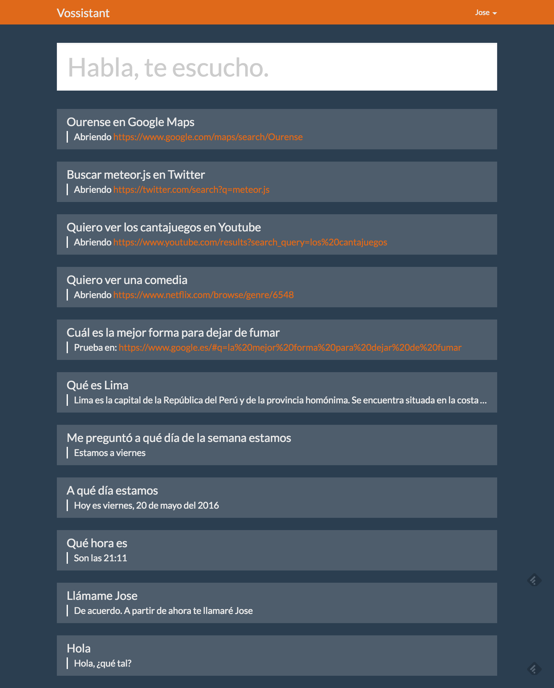

# vossistant

[](https://gitter.im/joseconstela/vossistant)
[](https://travis-ci.org/joseconstela/vossistant)
[](http://waffle.io/joseconstela/vossistant)

Multilanguage Natural Language Understanding application built in MeteorJS, using [Web Speech API / webkitSpeechRecognition](https://developer.mozilla.org/en-US/docs/Web/API/Web_Speech_API) for voice recognition and [SpeechSynthesisUtterance](https://developer.mozilla.org/en-US/docs/Web/API/SpeechSynthesisUtterance) for Natural Language replies. Based on Intentions & Entities principle, using regular expressions.

[Try it on modulus](https://vossistant-63519.onmodulus.net/) (database gets cleaned periodically).



## Example commands

*This table is just an example, as Vossistant supports multiple phrases and words that can trigger the same action.*

<table>
    <tr>
        <th>Actions</th>
        <th>Trigger(s)</th>
        <th>Other possibilities</th>
    </tr>
    <tr>
        <td>Greeting</td>
        <td>Hello</td>
        <td></td>
    </tr>
    <tr>
        <td>Change username</td>
        <td>Call me ```___```</td>
        <td></td>
    </tr>
    <tr>
        <td>Close session</td>
        <td>Logout</td>
        <td></td>
    </tr>
    <tr>
        <td>Search on wikipedia</td>
        <td>What is ```___```</td>
        <td></td>
    </tr>
    <tr>
        <td>Get the time</td>
        <td>What time is it</td>
        <td></td>
    </tr>
    <tr>
        <td>Search multimedia</td>
        <td>Search ```___``` in ```Youtube```</td>
        <td></td>
    </tr>
    <tr>
        <td>Netflix</td>
        <td>I want to see ```___```</td>
        <td>
          <ul>
            <li>a tv show</li>
            <li>an action movie</li>
            <li>a commedy</li>
            <li>a thriller</li>
            <li>...</li>
          </ul>
        </td>
    </tr>
    <tr>
        <td>Dilbert commic</td>
        <td>Dilbert</td>
        <td></td>
    </tr>
    <tr>
        <td>Google Maps search</td>
        <td>Show me a map for ```___```</td>
        <td></td>
    </tr>
    <tr>
        <td>Search on internet</td>
        <td>Search ```___``` at ```Google```</td>
        <td>
          <ul>
            <li>Youtube</li>
            <li>Google Maps</li>
            <li>Google</li>
            <li>Bing</li>
            <li>Twitter</li>
          </ul>
        </td>
    </tr>
</table>

See [i18n/en.i18n.json](https://github.com/joseconstela/vossistant/blob/master/i18n/en.i18n.json) for more clues.

## Flow

1. The server builds a list of regex-ready commands based on [intentions](https://github.com/joseconstela/vossistant/blob/master/server/ai.js#L1) and [entities](https://github.com/joseconstela/vossistant/blob/master/server/ai.js#54), called ```intelligence```.
2. User gives a command (it creates a mongo doc)
3. If the user input matches an intelligence phrase, it calls [actions](https://github.com/joseconstela/vossistant/blob/master/server/actions.js) (if any) to create actions. See below.
4. If the ```action``` returns ```text```, then ```text``` is saved within the user's original message mongo doc. (see the [chat collection schema](https://github.com/joseconstela/vossistant/blob/master/common/collections.js))
5. ```actions``` can also contain ```commands``` as in the following example, that can be executed server-side and client-side. See [common/commands.js](https://github.com/joseconstela/vossistant/blob/master/common/commands.js)

Example of an action response:

    {
        command: {
          application: 'browser',            // Currently: 'browser' or 'meteor'
          parameters: [url]                  // ie ['example.com/?q=', 'mysearch']
        },
        display: {                           // To display something on the user's screen
          title: '',
          link: '',
          html: ''                           // Inline html to be shown
        },
        say: 'Ok, openning ' + provider,     // What the FE will "say"
        text: 'Openning ' + url.join('')     // What will attached as the user's message reply
    }

## Author

Jose Constela (joseconstela.com)

## License

MIT.

Permission is hereby granted, free of charge, to any person obtaining a copy of this software and associated documentation files (the "Software"), to deal in the Software without restriction, including without limitation the rights to use, copy, modify, merge, publish, distribute, sublicense, and/or sell copies of the Software, and to permit persons to whom the Software is furnished to do so, subject to the following conditions:

The above copyright notice and this permission notice shall be included in all copies or substantial portions of the Software.

THE SOFTWARE IS PROVIDED "AS IS", WITHOUT WARRANTY OF ANY KIND, EXPRESS OR IMPLIED, INCLUDING BUT NOT LIMITED TO THE WARRANTIES OF MERCHANTABILITY, FITNESS FOR A PARTICULAR PURPOSE AND NONINFRINGEMENT. IN NO EVENT SHALL THE AUTHORS OR COPYRIGHT HOLDERS BE LIABLE FOR ANY CLAIM, DAMAGES OR OTHER LIABILITY, WHETHER IN AN ACTION OF CONTRACT, TORT OR OTHERWISE, ARISING FROM, OUT OF OR IN CONNECTION WITH THE SOFTWARE OR THE USE OR OTHER DEALINGS IN THE SOFTWARE.

# Other licenses

App icon: Linkware. http://www.pelfusion.com
